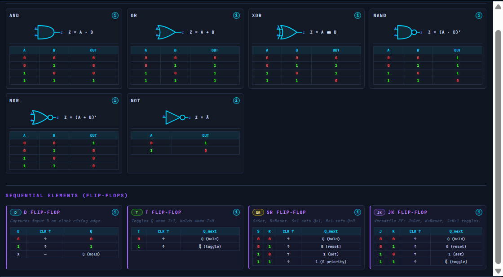

# ⚡ AND_GAME

### *A digital logic puzzle game in your browser.*

> Place gates. Wire flip-flops. Watch signals come alive.
> Learn how real hardware thinks — one circuit at a time.

<p align="center">
  <a href="https://MaozEpsein.github.io/AND_GAME/">
    <strong>▶ Play Now</strong>
  </a>
  &nbsp;·&nbsp;
  <a href="#-the-levels">Levels</a>
  &nbsp;·&nbsp;
  <a href="#-design-mode">Design Mode</a>
  &nbsp;·&nbsp;
  <a href="#-for-developers">Tech</a>
</p>

<p align="center">
  
</p>

---

## 🎮 What is AND_GAME?

AND_GAME is a browser-based puzzle game where each level is an **incomplete digital circuit**.
Inputs are wired in. Outputs have target values. Some boxes in the middle are empty — and that's where you come in.

Drag a logic gate, drop it in, and watch the signals propagate. Get every output to match its target, and you've solved the level.

It starts with a single `NOT` gate. By the end you're building **traffic-light controllers**, **CPU pipeline bypass logic**, and **LFSR scramblers** used in real Ethernet, USB and Bluetooth chips.

---

## 🧩 How It Plays

### Combinational Puzzles
Drag gates from the palette onto empty slots. The circuit re-evaluates instantly — green wires mean `1`, red mean `0`. Solve the truth table.

<p align="center">
  
</p>

Need a refresher on what each gate does? The built-in **info panel** gives you every truth table, plus a glimpse at the CMOS transistor structure underneath:

<p align="center">
  
</p>

### Truth Tables on Demand
Stuck on what the circuit is supposed to do? Open the truth table for the level — every input combination, every required output:

<p align="center">
  
</p>

### Sequential Puzzles (Flip-Flops)
Starting at level **31**, time enters the picture. Now you place flip-flops, hit **STEP** to deliver clock edges, and your outputs evolve over multiple steps.

The waveform display traces every signal through time, just like a real logic analyzer.

### See How It's Built
Wonder what's actually inside an `OR` gate? Each component has a transistor-level breakdown — the same circuits etched into real silicon:

<p align="center">
  
</p>

---

## 🛠 Design Mode

After level 60, the rails come off. **Design Mode** is a sandbox: place anything, wire it however you want, save it, share it with the world.

<p align="center">
  
</p>

**You get:**
- Inputs, outputs, gates, flip-flops, clocks, MUX switches, 7-segment displays
- Free-form wire drawing
- TEST mode to run your circuit
- EXPORT / IMPORT as JSON
- A **personal gallery** for your saves
- A **community gallery** — browse and like circuits built by other players, sync'd via Firebase

---

## 🗺 The Levels

61 levels across 7 difficulty tiers. Every puzzle has a unique, mathematically verified solution.

| Tier | Levels | Theme |
|------|--------|-------|
| 🟢 **Fundamentals** | 1–10 | NOT, AND, OR, NAND, NOR, XOR, gate chains, fanout |
| 🟡 **Building Blocks** | 11–20 | Half adder, parity, Gray code, MUX, DEMUX, priority encoder |
| 🟠 **Advanced Circuits** | 21–30 | Comparators, full adder, MUX trees, ripple-carry adder, decoders |
| 🔵 **Flip-Flops** | 31–40 | D / T / SR / JK, ripple counter, Johnson counter, shift register |
| 🟣 **Sequential Logic** | 41–50 | Synchronizers, debounce, LFSR, pipeline bypass, hazard detection |
| 🔴 **FSM Applications** | 51–60 | Elevator, traffic light, alarm, vending machine, CPU pipeline |
| ⚫ **Design Mode** | 61 | Sandbox — build whatever you want |

### Real Hardware, Real Lessons

Levels 41–50 are taken straight from production silicon:

- **L41** — Synchronizers used at every USB/SPI/I²C boundary
- **L42** — Button debounce circuits
- **L43** — PWM and UART generators
- **L44** — ARM interrupt flag management
- **L45** — x86/ARM register-file write-enable
- **L46** — DDR memory counters and 5G frequency dividers
- **L47** — LFSR scramblers in Ethernet CRC, USB 3.0, Bluetooth encryption
- **L48** — ARM Cortex pipeline bypass detection
- **L49** — GPIO edge detection, display controllers
- **L50** — Ethernet FSMs, PCI bus arbiters, cache control

---

## ✨ Features

- 🎯 **61 hand-crafted levels** with unique verified solutions
- 🎨 **Professional EDA aesthetic** — dark substrate, neon traces, monospace
- ⏱ **Per-level best times** with leaderboard-style stats
- 📊 **Truth tables** + **waveform timing diagrams**
- 🧠 **Hint system** — guidance without spoilers
- 🎓 **Interactive tutorials** at levels 1, 31, and 61
- 🛠 **Design Mode** sandbox with full component palette
- 🌐 **Community Gallery** — share circuits worldwide via Firebase
- 💾 **Local saves** — progress and gallery stored in your browser
- ⌨️ **Full keyboard support** — every tool has a shortcut

---

## ⌨️ Keyboard Shortcuts

| Key | Action |
|-----|--------|
| `Space` | Deliver one clock edge (sequential levels) |
| `W` | Toggle waveform display |
| `H` | Toggle hint |
| `Ctrl+Z` / `Ctrl+Y` | Undo / Redo |
| `Esc` | Close any overlay |
| `Ctrl+Shift+R` | Clear all placed components |
| `Ctrl+Shift+S` | Auto-solve (dev tool) |

**Design Mode:** `S` Select · `I` Input · `O` Output · `G` Gate · `F` Flip-Flop · `C` Clock · `M` MUX · `7` 7-Seg · `W` Wire · `D` Delete · `T` Test · `E` Export · `P` Import · `K` Save · `L` Gallery · `R` Share

---

## 🔧 For Developers

Pure HTML5 Canvas + Vanilla JavaScript. No build step. No framework. Open `index.html` and it runs.

### Stack
- **Rendering:** HTML5 Canvas, `requestAnimationFrame`
- **Logic:** Vanilla JS, topological-sort DAG evaluator (Kahn's algorithm)
- **Persistence:** `localStorage` for progress, Firebase Firestore for community gallery
- **Styling:** Hand-rolled CSS, JetBrains Mono

### File Layout

```
AND_GAME/
├── index.html          # Canvas, DOM overlays, Firebase SDK init
├── style.css           # Dark EDA theme + all UI
├── firestore.rules     # Community gallery security rules
└── js/
    ├── main.js         # Bootstrap, game loop, menus, gallery, tutorials
    ├── state.js        # Level state, FF states, clock control
    ├── engine.js       # 3-phase DAG evaluator, gate/FF functions
    ├── renderer.js     # Canvas rendering for nodes, wires, timelines
    ├── input.js        # Drag-and-drop and hit testing
    ├── waveform.js     # Sequential timing diagram
    ├── sound.js        # Audio playback
    └── levels.js       # 61 level definitions + solution SVGs
```

### Evaluation Engine

**Combinational** — every gate placement triggers a forward propagation pass through the DAG. Each node evaluates exactly once after upstream dependencies resolve.

**Sequential** — runs a 3-phase pipeline per clock edge:

1. **Propagate** — evaluate combinational nodes; FFs emit their stored Q
2. **Clock Edge** — detect rising edges, update FF states via next-state functions
3. **Re-propagate** — if any FF changed, re-evaluate downstream nodes

```js
const GATE_FN = {
  AND:  (a, b) => a & b,
  OR:   (a, b) => a | b,
  XOR:  (a, b) => a ^ b,
  NAND: (a, b) => (a & b) ^ 1,
  NOR:  (a, b) => (a | b) ^ 1,
  NOT:  (a)    => a ^ 1,
};

const FF_FN = {
  D:  (args, q) => ({ q: args[0], qNot: args[0] ^ 1 }),
  T:  (args, q) => args[0] ? { q: q^1, qNot: q } : { q, qNot: q^1 },
  SR: (args, q) => { /* S sets, R resets, S wins on conflict */ },
  JK: (args, q) => { /* J=K=1 toggles */ },
};
```

### Win Condition

```
win = (stepCount ≥ minSteps) AND (∀ output o: o.computedValue === o.targetValue)
```

For multi-step levels, if all required steps complete without matching, a fail overlay appears with a retry option.

---

<p align="center">
  <em>AND_GAME — built in the browser. Powered by boolean algebra and sequential logic.</em>
  <br/>
  <a href="https://MaozEpsein.github.io/AND_GAME/"><strong>▶ Play it</strong></a>
</p>
